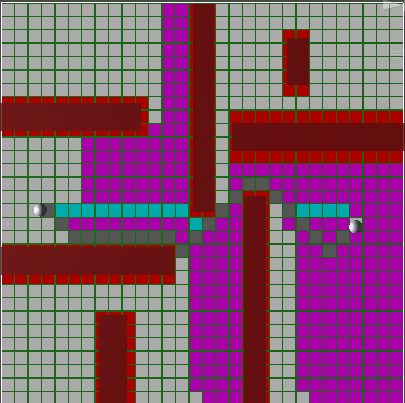
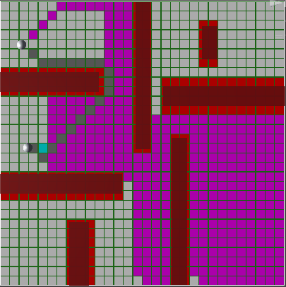
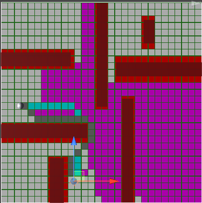
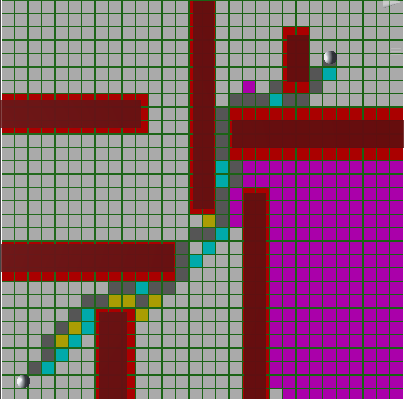

# Project 1 - CSC 4301 - Introduction to Artificial Intelligence

## Introduction

In this project, Chifaa Bouzidi and I will replicate @SebLague's pathfinding project and test several search algorithms (A*, DFS, BFS, UCS) and heuristic techniques, assuming that all search algorithms have the same cost in all orientations and A* with various heuristics. You can observe distinct pathways identified by each strategy concurrently with different colors and the overall time it takes each approach when running this project in unity.

## Color Code

- Blue - @SebLague's A Star Heuristic
- Black - BFS
- Yellow - UCS
- Magenta - DFS
- Cyan - A Star with Manhattan Heuristic
- Grey - A Star with Euclidean Heuristic

## Performance Analysis

Using the following game map:

We can comapre all the used algorithms by time taken to find the path as well as the number of nodes in the path.
### A* (@SebLague's A Star Heuristic)

With the A* algorithm, we got the following results:

taking only 1ms with a path length of 23
 
 ### A* (Euclidean Heuristic)

With the A* (Euclidean Heuristic) algorithm, we got the following results:

taking 2ms with a path length of 23

 ### A* (Manhattan Heuristic)

With the A* (Manhattan Heuristic) algorithm, we got the following results:

taking 2ms with a path length of 23

### Depth First Search - DFS

With the DFS algorithm, we got the following results:

taking 1ms with a path length of 304
 
 ### Breadth First Search - BFS

With the BFS algorithm, we got the following results:

taking 34ms with a path length of 23
 
  ### Uniform Cost Search - UCS

With the UCS algorithm, we got the following results:

taking 4ms with a path length of 23

## Other Positions

## Conclusion

We may infer that A* is the quickest algorithm in the selection, although it is significantly reliant on the heuristic it is provided with. The shortest route was also found using BFS, however it takes longer than any other method.

## References

Sebastian Lague Youtube channel: https://www.youtube.com/watch?v=-L-WgKMFuhE&list=PLFt_AvWsXl0cq5Umv3pMC9SPnKjfp9eGW

